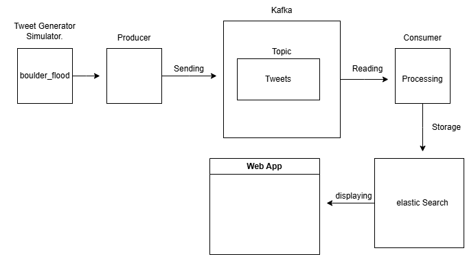

# Twitter Stream  Pipeline

# description of the project 
The goal of this project is to create a processing pipeline for a set of streaming tweets and then display them on a web page so that the user can perform specific queries on the tweets.
The processing process includes extracting hashtags,performing sentiment analysis on each tweet, and indexing the data from the tweet in a way that facilitates searching and querying it.

## Team Members

This project was developed by the following team members:

1. Ghaith abo hantash(Software Engineer) Role/Responsibilities : (Manage the flow of data from the producer to the consumer and process it in the consumer)
2. Mohammed Alawneh(Software Engineer) - Role/Responsibilities :  (Create a Sentiment Analysis Model and Store in Elastic Search (Shared Task))
3. Ibrahem Khdire(Artificial Intelligence Engineer)- Role/Responsibilities  : (Design an appropriate schema  in elastic Search and create Web Application)
4. Ahmad Obaid(Artificial Intelligence Engineer) - Role/Responsibilities  :(Design an appropriate schema  in elastic Search and create Web Application)

## Main components of the project

### 1.Production and consumption of tweets : 
-** Tweet Source: Tweet Generator Simulator(boulder_flood_geolocated_tweets)
-** Apache Kafka : Used to store tweets in a topic for scalability and reliability.

### 2.   The Processing: 
- **Data Transformation**: Tweets and their needs (text, time, location) are saved with a renewable configuration.
- **Hashtag Extraction**: Hashtags are extracted from tweets and stored in a nested array.
- **Sentiment Analysis**: Using Spark NLP or TextBlob to analyze sentiment in texts.

### 3. Storage: 

- ** Elasticsearch**: To store tweets and their metadata after processing.
- ** Design a  schema to ensure fast and efficient inquiries.

### 4. Web Application:
- **User Interface**: Provides an easy-to-use interface to search for tweets using keywords.
- **View on Map**: Display tweets containing the entered word on an interactive map.
- **Wind Graph for Trends**: Displays the distribution of tweets over time on an hourly and daily basis.
- **Sentiment Analysis Scale**: The average sentiment score of tweets over a specific time period is depicted.

## Tools used

- ** Kibana Maps : To display tweets and interact
- ** Spark NLP  : Libraries for sentiment analysis.
- ** Apache Kafka** : To manage data flow.
- **  Elasticsearch** : To store data.
- ** Kibana** : To set up the web application environment.

## System Requirements
- **Kibana**: To interact with tweets and make queries
- **Elasticsearch**: To set up the database.
- **Apache Kafka**: If you will use Kafka to store tweets.
- **Scala and Spark**: If you use Spark NLP and to manage the tweet stream
- **Tweet generator simulator or Twitter API

1. **Local Environment Setup**:
- Install [spark](https://nodejs.org) 
- Install  [Elasticsearch](https://www.elastic.co/elasticsearch/).
- Install [Apache Kafka](https://kafka.apache.org/).
- Install [Kibana](https://www.elastic.co/kibana/).

## Install and run the project

**- Install and run the project as a clone main repository  
To clone the repository, follow these steps:
1. Open your terminal or command prompt.
2. Run the following command to clone the repository to your local machine:

   ```bash
   git clone https://github.com/Ghaith-abohantash/twitter-stream-pipeline.git
 To run a tweet stream to Kafka and receive and process it from the consumer, you must:
 1. Open your terminal or command prompt  in Kafka Folder and Run ZooKeeper : (.\bin\windows\zookeeper-server-start.bat .\config\zookeeper.properties)
 2. Open your terminal or command prompt  in Kafka Folder and Run server : (.\bin\windows\kafka-server-start.bat .\config\server.propert)
 3- Run the Producer.scala code in the terminal 
 4-Run the Consumer.scala in  Another terminal

## Project Pipeline Diagram

The diagram below shows the structure of the data pipeline:




